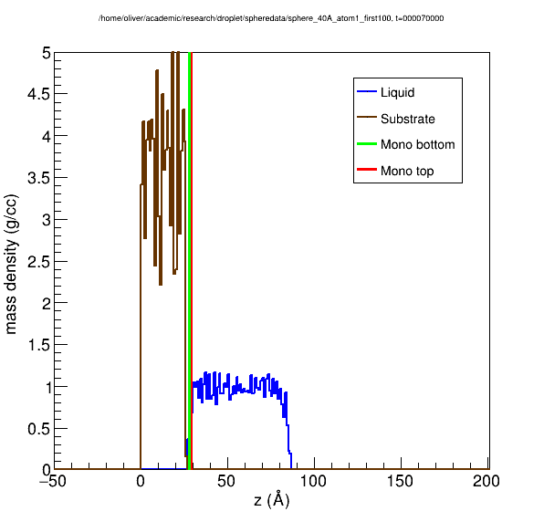
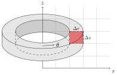
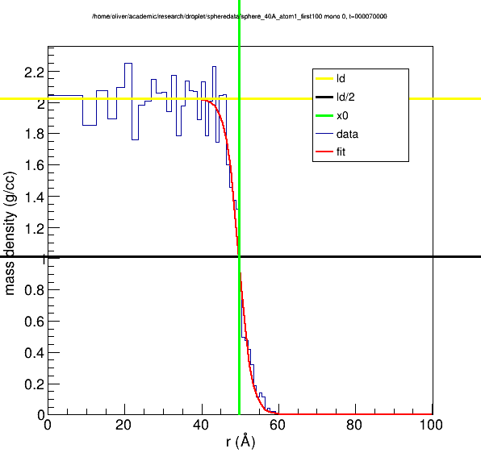
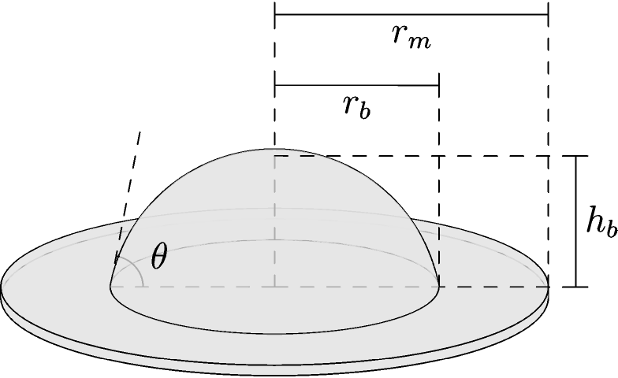
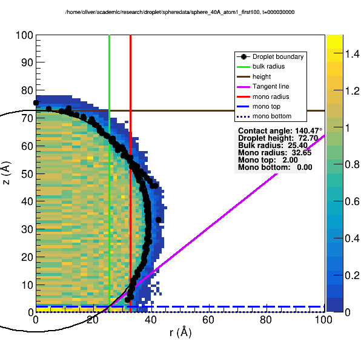

.. _`overview.rst`:

Overview
========

The basic idea is as follows

.. todo:: mention frame averaging

.. todo:: mention cylinder droplets

1D Density Profile
------------------
A 1-dimensional density profile in :math:`z` is constructed for
the substrate and liquid, identifying the extent of each.

The substrate is assumed to encompass the entire :math:`x-y` extent
of the simulation box, so all atoms are used.
The droplet is assumed to be located at the :math:`x-y` of the
simulation box, so only atoms within a thin vertical cylinder
are used to determine the droplet density.

The substrate density profile is used to locate the top of the substrate.
All further z positions will be shifted such that the substrate top is :math:`z=0`.
The droplet density profile is used to determine the :math:`z` extent
of the monolayer if this feature is desired.

.. todo:: remove

.. _dens-figure:

   Figure 1

   1D Density Profile.

2D Density Profile
--------------------
A mass density histogram is created from atom positions
using equal-volume rectangular bins in the cylindrical :math:`r-z` plane.

.. _bin-figure:

   Figure 2

   Shape of a histogram bin for spherical droplets.

.. todo:: expand on this

Location of Boundary Points
---------------------------
In order to locate the liquid-vapor interface,
we seek to find points on this histogram where the density is
half the liquid density.
To do so, we take each row and column separately
as a one dimensional histogram of :math:`r` vs :math:`\rho` or :math:`z` vs :math:`\rho`
for rows and columns respectively.
The shape of each such 1d projection is expected to resemble
a transformed hyperbolic tangent function.
For each projection, we fit the function

.. math::
   \rho(x) = \frac{\rho_l}{2} \left(1 - \tanh\left(\frac{4(x-x_0)}{w}\right) \right)

and consider the fitted value of :math:`x_0` (the location where :math:`\rho(x) = \rho_l/2`) to be a point on the liquid-vapor interface.

.. todo::
   Define parameters in above equation

.. todo::
   Remove 4*

.. _tanh-figure:

   Figure 3

   Hyperbolic tangent fitting for boundary location.

Calculation of Geometric Quantities of Interest
-----------------------------------------------
By repeating this for each row and column, we obtain a set of points which roughly define the boundary of the droplet in the :math:`r-z` plane.
We then mirror these points about the :math:`z` axis in the :math:`r-z` plane
and fit a circle to the resulting set of points, whose center
lies on the :math:`z`-axis.
The surface obtained by revolving this circle about the :math:`z`-axis
contains the approximate surface of the bulk of the droplet.

The geometrical quantities of interest are:

- Bulk radius (:math:`r_b`)
- Monolayer radius (:math:`r_m`)
- Bulk height (:math:`h_b`)
- Contact angle (:math:`\theta`)

.. _quantities-figure:

   Figure 4

   Quantities of interest for spherical droplets.

If monolayer calculations are enabled, a 1D histogram (:math:`r` vs :math:`\rho`)
is created and filled with atoms within the :math:`z`-extent of the monolayer
determined from the 1D density profile.
While the molayer density tends to be higher than the bulk density,
the same hyperbolic tangent fitting procedure can be applied
to calculate the monolayer radius, defined as the radius where
the monolayer density is half of its density towards the center
(although it may also be defined as the radius where the monolayer
density is half of the bulk liquid density).

Then, the plane which defines the upper surface of the monolayer is
intersected with the circle defining the bulk boundary in the :math:`r-z` plane.
The radius at which this intersection occurs is defined to be the bulk radius.
The angle the tangent line to the circle at the intersection
makes with the :math:`r`-axis (rotating the tangent line in to the droplet)
is the contact angle.
The positive :math:`z`-value of the circle at :math:`r=0` is the bulk height.

.. _droplet-figure:

   Figure 5

   Density histogram with calculated quantities annotated.

If monolayer calculations are disabled, then the top of the substrate
is taken to be the plane of intersection rather than the top of the monolayer.
If no substrate atoms are present, this interface can be specified manually.

.. todo::
   Link to this option.

